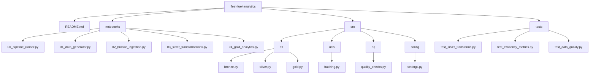

# fleet-fuel-analytics - End-to-end data engineering project
*Vehicle telemetry - Delta lake - CDC - Bronze/Silver/Gold - Data Quality Framework - Pyspark*


This project simulates a real-world data platform for a delivery/logistics company.  
It processes vehicle telemetry events to compute fuel efficiency, driving patterns, and operational KPIs used by fleet managers.

The solution is fully implemented on **Databricks Community Edition (free)** with integration to **GitHub** — making it suitable for portfolio demonstration without cloud costs.

---

## 📌 Objectives

- Build an **incremental ELT pipeline** (Bronze → Silver → Gold)
- Support **CDC (Change Data Capture)** with Delta Lake `MERGE`
- Enrich telemetry events with business logic (trips, consumption, distances)
- Implement a **Data Quality Framework** with auditable checks
- Generate **daily fuel efficiency metrics** (km/L) for each vehicle
- Produce curated tables ready for BI dashboards
- Orchestrate executions via airflow
- Document performance, governance, and design trade-offs

---

# 🏗️ Architecture Overview

### **Layers**
Source (Simulated Telemetry)
↓
Bronze (Raw + CDC + Metadata)
↓
Silver (Cleaned + Standardized + Derived Features)
↓
Gold (Aggregated KPIs + Business Metrics)
↓
BI / Analytics (PowerBI / Databricks SQL)


### **Key Components**
- **PySpark** for transformations  
- **Delta Lake** for ACID + CDC + time travel  
- **Partitioning** by ingestion date  
- **Record hashing** to detect updates  
- **Incremental processing** using Delta `MERGE`  
- **Data Quality Table** for logging check results  
- **Notebook Orchestration** to simulate production pipelines  

---

# 📊 Data Model

### **Bronze – Raw Telemetry (fleet_telemetry_bronze_cdc)**
- `event_id`  
- `vehicle_id`  
- `event_ts`  
- `lat`, `lon`  
- `speed_kmh`  
- `odometer_km`  
- `fuel_level_pct`  
- `engine_on`  
- `record_hash`  
- `batch_id`  
- `ingestion_ts`  
- `is_deleted`  

Purpose: store raw events with CDC and metadata.

---

### **Silver – Enriched Telemetry**
Adds:
- `prev_odometer`, `prev_fuel`
- `delta_km`, `delta_fuel_pct`
- `trip_id`
- `day`, `hour`

Purpose: derive business features and clean invalid data.

---

### **Gold – Daily Efficiency**
- `vehicle_id`
- `day`
- `total_km`
- `fuel_liters`
- `km_per_liter`

Purpose: enable BI dashboards with operational KPIs.

---

# 🔁 Incremental & CDC Flow

The pipeline supports:
- Inserts
- Updates (recalculating business metrics)
- Soft deletes

Using Delta MERGE:

```sql
MERGE INTO fleet_telemetry_bronze_cdc AS tgt
USING fleet_telemetry_bronze_staging AS src
ON tgt.event_id = src.event_id
WHEN MATCHED AND src.op = 'U' THEN UPDATE SET ...
WHEN MATCHED AND src.op = 'D' THEN UPDATE SET is_deleted = true
WHEN NOT MATCHED AND src.op = 'I' THEN INSERT ...
```
This design mirrors real enterprise pipelines (ERP → Lakehouse).

---

🧪 Data Quality Framework

A custom framework logs results of all checks into a table (dq_results):

table_name	layer	check_name	status	failed_rows	checked_at
fleet_telemetry_silver	silver	speed_range	PASS	0	2025-01-01
fleet_telemetry_silver	silver	fuel_pct_range	FAIL	32	2025-01-01

Checks include:

- Schema validation
- Range checks (speed, fuel)
- Nullability
- Business rules
- Duplicate ID detection

The entire DQ logic is modular and reusable.

---

Project Structure



---

⚙️ Performance Considerations

The project documents:

- Partitioning by ingestion_dt
- Why Delta is used instead of Parquet
- Avoiding full table scans via incremental MERGE
- Choosing the right cluster size (even in free tier)
- Compaction strategies (OPTIMIZE)